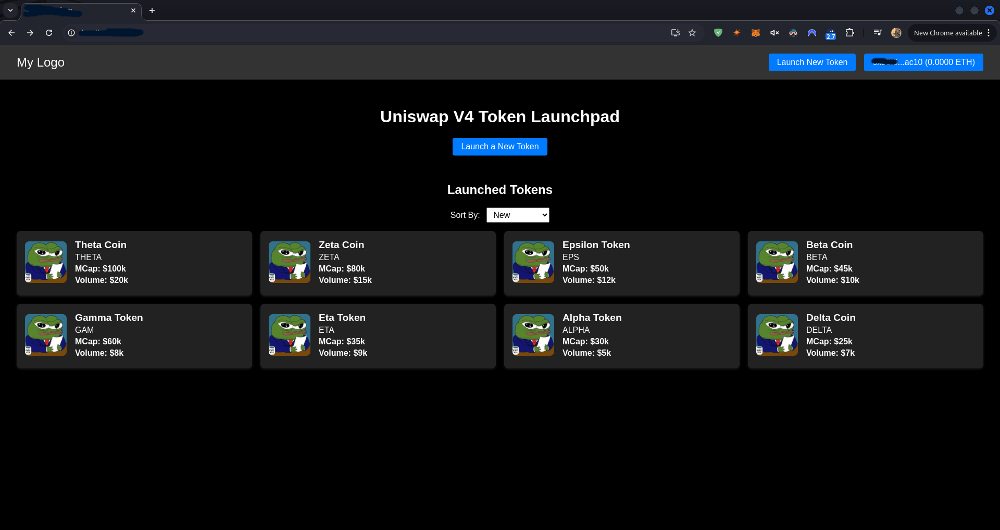
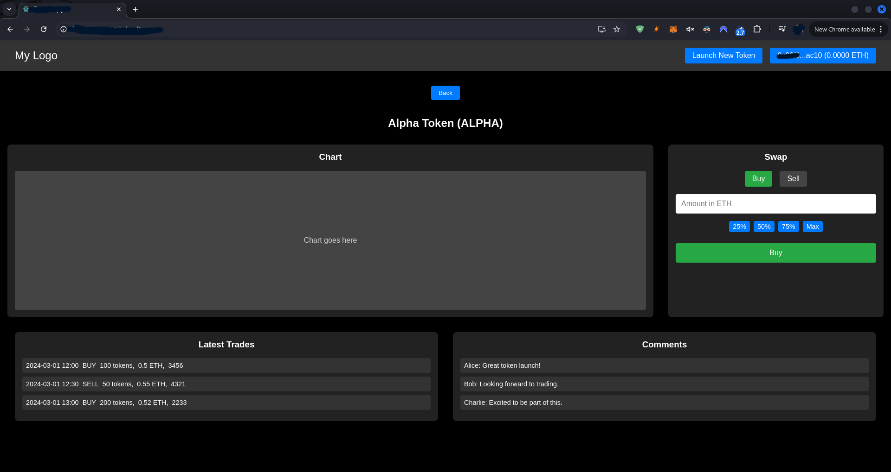
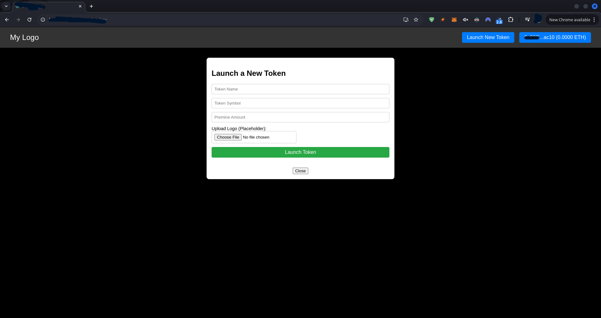
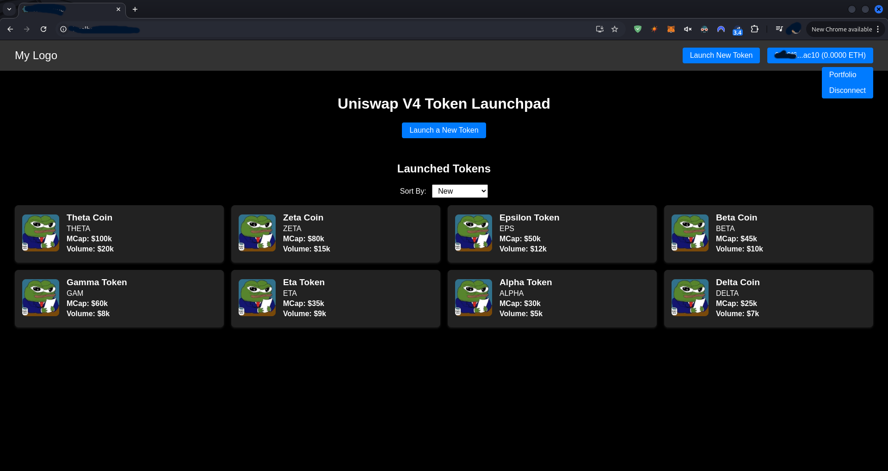

# Token Launcher

🚀 Token Launcher is a decentralized application (dApp) for launching, trading, and managing tokens on the blockchain. Built with React, Vite, ethers.js, and React Router v6, it features a modern dark-themed interface with advanced token creation, swap functionality, and market overview.

## Features

- **Wallet Integration:**  
  Connect your Ethereum wallet (e.g., MetaMask) to view your balance and interact with the dApp.
  
- **Token Launching:**  
  Create and deploy new tokens with fixed parameters for supply, fee, and more.

- **Market Overview:**  
  The Home page displays tokens in a grid layout, with each card showing a token image, name, symbol, and current market cap (e.g., "MCap: $30k").

- **Token Details:**  
  Each token’s detail page includes:
  - A dynamic chart displaying price trends
  - A swap panel to buy (in ETH) or sell (in token units), with quick percentage buttons (25%, 50%, 75%, Max) for setting amounts.
  - A list of recent trades, each shown in one line with a timestamp, trade type, token amount, ETH amount, and the last 4 digits of the wallet.
  - A comment section for community feedback.

- **Global Navigation:**  
  A persistent header shows the logo (click to return home), a wallet connect button (displaying account and balance when connected), and a "Launch New Token" button (active only when a wallet is connected).

**Compatible with all EVM chains that support Uniswap V4 (e.g., Ethereum, Base, Unichain etc.)**

For more information, contact us via [Telegram](https://t.me/solidmarketing)

## Screenshots

